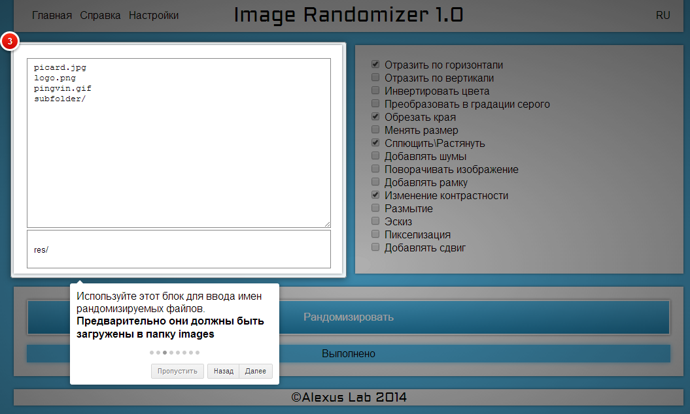
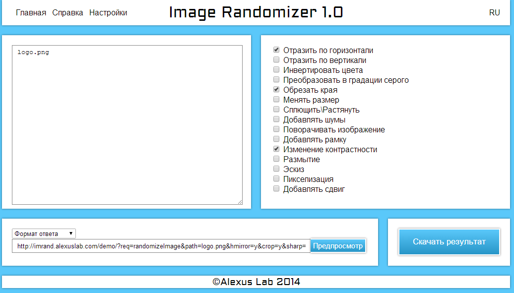
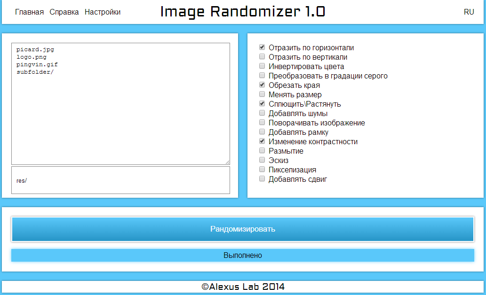
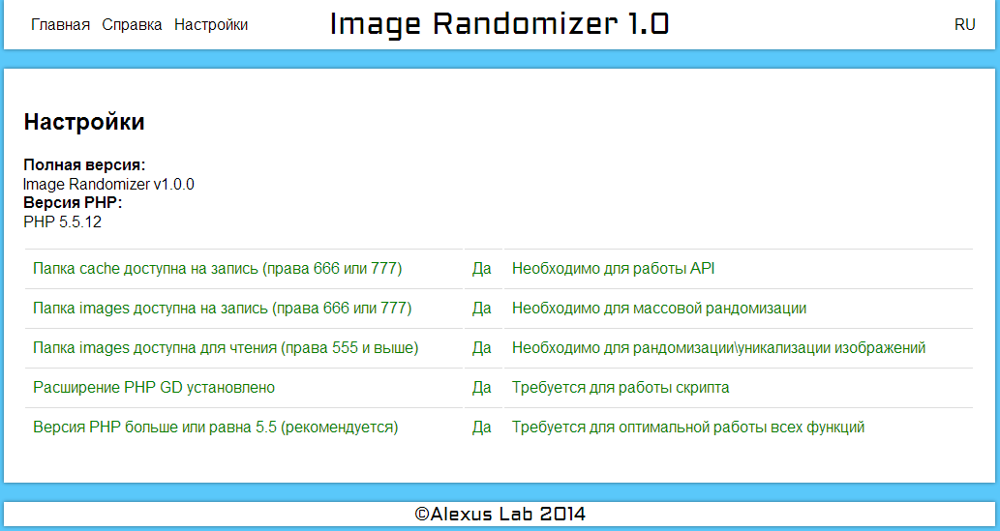

# image-randomizer
Image Randomizer - bulk image randomization tool with API

Рандомизатор Избражений - инструмент для массовой рандомизации изображений с API

## English

[Documentation PDF - Russian, English docs are built in](../../raw/master/doc_v1.0.ru.pdf) (TODO: make online version. github version?)

[Demonstration service](http://imrand.alexuslab.com/demo/)

###[Download](../../raw/master/imageRandomizer_latest.zip)

####Functionality:
- A lot of randomization methods
- methods can be rearranged
- bulk randomization
- API, can be integrated with different software, like [alexusMailer](https://github.com/AlexusBlack/alexusMailer-2)

####Problems & Goals:
- Methods must have settings
- All methods must have reverse option (if possible)
- file chooser
- exif randomization

## Russian

[Документация PDF](../../raw/master/doc_v1.0.ru.pdf) (TODO: сделать онлайн версию. github версия?)

[Демонстрационный сервис](http://imrand.alexuslab.com/demo/)

###[Скачать](../../raw/master/imageRandomizer_latest.zip)

####Функционал:
- Множество методов рандомизации
- Порядок методов можно менять
- Массовая обработка
- API, можно интегрировать с другим софтом, например [alexusMailer](https://github.com/AlexusBlack/alexusMailer-2)

####Проблемы и задачиs:
- Настройки у методов
- Все методы должны быть обратимы (если возможно)
- выбор файлов
- рандомизация exif

###Screenshots \ Скриншоты
####Tutorial \ Туториал

####Main Screen \ Главный экран

####Bulk randomization \ Массовая рандомизация

####Settings \ Настройки

